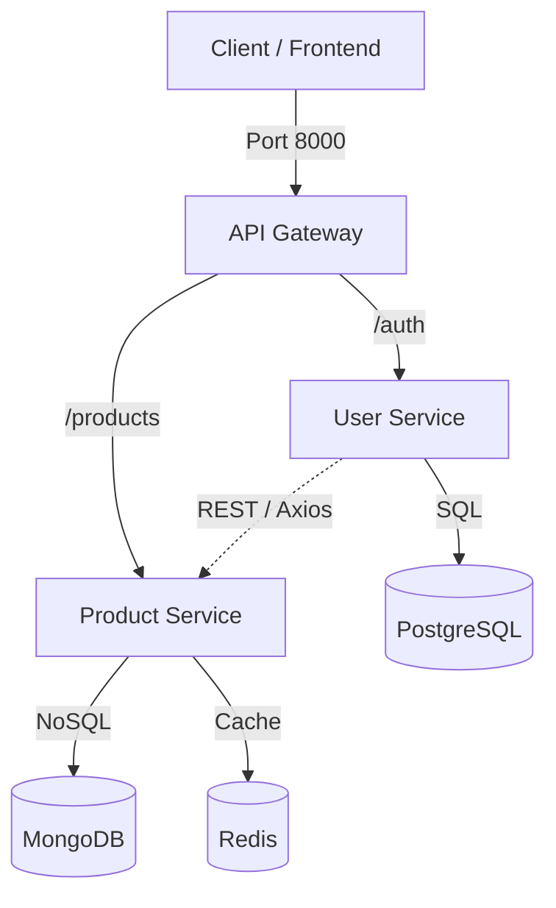

# Cloud-Native E-Commerce Microservices

A robust, scalable backend architecture built from scratch to demonstrate the core principles of Microservices, Containerization, Polyglot Persistence, and Orchestration.

This project moves beyond monolithic design by decoupling services, implementing an API Gateway, ensuring inter-service communication, and deploying to a production-grade Kubernetes cluster.

---

## 🏛 Architecture Overview

The system consists of three distinct Node.js services and three infrastructure components, all orchestrating together.



---

## 🧠 Key Learnings & Modules

We built this project in 7 distinct stages, evolving from simple scripts to a cloud-native cluster.

| Module                      | Concept Learned          | Implementation                                                                                     |
| :-------------------------- | :----------------------- | :------------------------------------------------------------------------------------------------- |
| **1. Microservices**        | Decoupling logic         | Split monolithic app into `user-service` and `product-service`.                                    |
| **2. Polyglot Persistence** | Right tool for the job   | Used **PostgreSQL** for relational data (Users) and **MongoDB** for flexible documents (Products). |
| **3. Dockerization**        | "Works on my machine"    | Created `Dockerfile` for each service and orchestrated with `docker-compose`.                      |
| **4. Communication**        | Synchronous REST         | Implemented an Aggregator Pattern where User Service calls Product Service to build a Dashboard.   |
| **5. API Gateway**          | Unified Entry Point      | Built a reverse proxy on Port `8000` to hide internal microservice ports (`3001`/`3002`).          |
| **6. Caching**              | High Performance         | Implemented **Redis** (Cache-Aside pattern) to reduce database load significantly.                 |
| **7. Kubernetes**           | Production Orchestration | Deployed the entire stack to a local K8s cluster using Deployments and Services.                   |

---

## 💻 Tech Stack

* **Runtime:** Node.js (Express)
* **Databases:** PostgreSQL (SQL), MongoDB (NoSQL)
* **Caching:** Redis
* **Containerization:** Docker & Docker Compose
* **Orchestration:** Kubernetes (K8s) & `kubectl`
* **Gateway:** `http-proxy-middleware`

---

## 📦 Service Breakdown

| Service Name        | Internal Port | Database        | Responsibility                                        |
| :------------------ | :-----------: | :-------------- | :---------------------------------------------------- |
| **API Gateway**     |     `8000`    | N/A             | Routing traffic, security, rate limiting.             |
| **User Service**    |     `3001`    | PostgreSQL      | User authentication, profile management, aggregation. |
| **Product Service** |     `3002`    | MongoDB + Redis | Product catalog, inventory, caching.                  |

---

## 🚀 Quick Start (Docker Compose)

The easiest way to run the project locally for development.

1. **Clone & Setup Environment:**
   Ensure you have `.env` files in your service folders or configured in `docker-compose.yml`.

2. **Launch the Architecture:**

```bash
# from project root
docker-compose up --build
```

3. **Verify Running Services:**
   You should see logs for `postgres`, `mongo`, `redis`, and all Node apps.

---

## ⚓ Deployment (Kubernetes)

Moving from development to a production-like environment.

1. **Enable Kubernetes** in Docker Desktop or your Kubernetes provider.
2. **Navigate to K8s folder:**

```bash
cd k8s
```

3. **Apply Manifests:**

```bash
# Infrastructure
kubectl apply -f postgres-deployment.yaml -f postgres-service.yaml
kubectl apply -f mongo-deployment.yaml -f mongo-service.yaml
kubectl apply -f redis-deployment.yaml -f redis-service.yaml

# Apps
kubectl apply -f user-deployment.yaml -f user-service.yaml
kubectl apply -f product-deployment.yaml -f product-service.yaml
kubectl apply -f gateway-deployment.yaml -f gateway-service.yaml
```

4. **Expose Gateway (for local testing):**

```bash
kubectl port-forward svc/api-gateway 8000:8000
```

> Note: For production, use an Ingress controller (e.g., NGINX Ingress or cloud provider load balancer) rather than `port-forward`.

---

## 🔌 API Endpoints

All requests should be made to the **Gateway** (`http://localhost:8000`).

### 1. Health Check

* **GET** `/`

  * **Response:** `{"message": "API Gateway is Running"}`

### 2. User Operations (proxied to User Service)

* **POST** `/auth/register`

  * **Body:** `{ "username": "Neo", "email": "neo@matrix.com" }`
* **GET** `/auth/dashboard/:id`

  * **Returns:** Combined user profile (SQL) + recommended products (NoSQL).

### 3. Product Operations (proxied to Product Service)

* **GET** `/products`

  * **Feature:** First request hits DB; subsequent requests are served from Redis cache (Cache-Aside).
* **POST** `/products`

  * **Body:** `{ "name": "Docker Super Computer", "price": 5000 }`
  * **Feature:** Automatically invalidates Redis cache after write.

---

## 🔮 Future Improvements

* **Asynchronous Communication:** Implement RabbitMQ or Kafka for `OrderPlaced` events.
* **Security:** Add JWT authentication (at the Gateway or per-service) and mTLS for service-to-service communication.
* **Resiliency:** Add circuit breakers (e.g., `opossum` or `resilience4js`), retries, and bulkheads so the User Service remains stable if Product Service is degraded.
* **Observability:** Add structured logging, distributed tracing (OpenTelemetry), and metrics (Prometheus + Grafana).

---

If you want, I can also:

* Generate working `Dockerfile`s and `docker-compose.yml` for each service.
* Produce Kubernetes manifests (Deployments, Services, ConfigMaps, Secrets) with best practices.
* Add example Express route handlers for the Gateway, User Service, and Product Service (including cache logic).

Tell me which of those you want next and I'll add them directly into this document.
